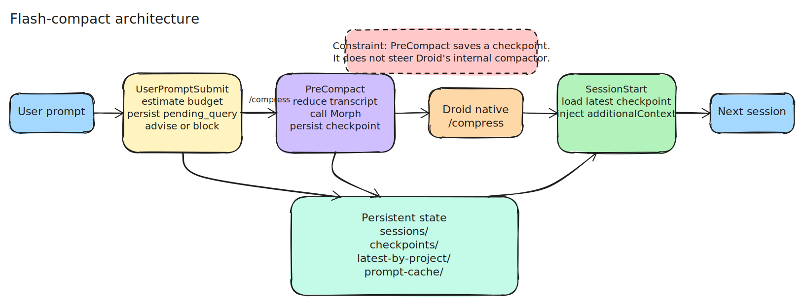

# Compaction Architecture

This repository's flash-compact system wraps Droid's native `/compress` flow with a provider-agnostic memory layer.



Editable source: `./diagram.excalidraw`

## One-sentence mental model

Flash-compact does **not** replace Droid compaction. It creates a better checkpoint **before** compaction and reloads that checkpoint **after** compaction or resume.

## Terminology

- In Droid's hook/runtime surface, the relevant event names are still `PreCompact` and `SessionStart(source = compact)`.
- In the user-facing CLI, full chat-history summarization is `/compress`.
- In this setup, `/compact` is reserved for a future delete-only flash-compact flow and is treated as distinct from native `/compress`.

This branch does **not** implement a custom `/compact` slash command yet; it only makes the flash-compact system align with that intended model.

## Why this exists

Long-running Droid sessions eventually need compaction, but a normal compact boundary can drop details that still matter later:

- concrete file paths
- intermediate decisions
- unresolved blockers
- the exact user intent that shaped the work

Flash-compact preserves that information as a deliberately reduced checkpoint that survives the compact boundary.

## The key design constraint

The whole system is shaped around one constraint:

- `PreCompact` may run before compaction
- but it is **not** assumed to modify Droid's internal compaction turn
- therefore the system gets its value from:
  1. checkpoint generation before compaction
  2. checkpoint hydration after compaction

That keeps the implementation aligned with documented hook behavior instead of depending on undocumented prompt injection semantics.

## End-to-end flow

### 1. UserPromptSubmit: budget scheduling and gating

`hooks/user_prompt_submit/flash_compact_budget.py`

This hook runs on every prompt submission and answers two questions:

1. Are we approaching the context budget?
2. If so, should we advise or block?

It:

- estimates token growth from transcript + incoming prompt
- records the latest prompt as `pending_query`
- skips non-blocking slash commands such as `/compact`, `/compress`, `/clear`, `/new`, and `/resume`
- uses hybrid triggering:
  - **soft**: advisory reminder
  - **hard**: block, save the prompt, and require compression first

### 2. PreCompact: checkpoint generation

`hooks/pre_compact/flash_compact.py`

When compaction is about to happen, this hook:

- reads the transcript
- extracts normalized compact entries
- derives the best available query from:
  - manual `/compress` instructions
  - pending query from the budget hook
  - latest user prompt
- applies typed reducers to older low-signal history
- sends the reduced view to Morph Compact
- writes checkpoint content + metadata to persistent state

It does **not** attempt to steer the native Droid compactor.

### 3. Droid native compaction

Droid performs its own compact operation normally.

Flash-compact treats this as an independent step, not something it rewrites.

### 4. SessionStart: hydration into the next session

`hooks/session_start/flash_compact_hydrate.py`

On `source = compact` or `source = resume`, the new session:

- finds the latest checkpoint for the current project
- loads the checkpoint text
- injects it as `additionalContext`
- includes blocked-prompt recovery info when relevant

This is where the saved checkpoint becomes useful to the next session.

## Hook responsibilities at a glance

| Hook | Role | Writes | Reads |
| --- | --- | --- | --- |
| `UserPromptSubmit` | estimate budget, advise/block, persist user intent | session state, optional blocked prompt cache | transcript, session state |
| `PreCompact` | build reduced transcript and persist Morph checkpoint | checkpoint text, checkpoint metadata, session state | transcript, session state |
| `SessionStart` | hydrate the next session from latest checkpoint | none | latest checkpoint + checkpoint content |

## The two important execution paths

### Normal path

1. user keeps working
2. budget hook may advise `/compress`
3. user runs `/compress`
4. `PreCompact` saves checkpoint
5. Droid compacts
6. `SessionStart` hydrates checkpoint into the new session

### Hard-budget recovery path

1. user submits a prompt after hard threshold is exceeded
2. budget hook blocks the prompt
3. the blocked prompt is saved to prompt cache
4. user runs `/compress`
5. `PreCompact` saves checkpoint
6. compacted session starts
7. `SessionStart` injects checkpoint and references the saved blocked prompt

## Typed reducer pipeline

The reducer layer exists to improve signal before data reaches Morph.

Without reducers, long sessions over-preserve tool noise. With reducers, older history is transformed conservatively rather than deleted blindly.

### Current reducer behavior

- old `Execute` results become summaries that keep:
  - command metadata
  - head lines
  - tail lines
  - selected high-signal lines
- old `Read` results keep targeting metadata, not bulk file output
- old `TodoWrite` states collapse to the latest relevant older todo snapshot
- recent turns stay comparatively raw

### Why this split works

The architecture treats **recency** and **importance** as different axes:

- recent turns are preserved for fidelity
- older turns are preserved for evidence, but in reduced form

That gives Morph cleaner input without pretending that old tool output is worthless.

## Persistent state layout

All flash-compact state is rooted under the configured `state_dir`.

```text
state_dir/
├── sessions/
│   └── <session-id>.json
├── checkpoints/
│   ├── <session-id>-<timestamp>.txt
│   └── <session-id>-<timestamp>.json
├── latest-by-project/
│   └── <project-hash>.json
└── prompt-cache/
    ├── <timestamp>-<session-fragment>-<digest>.md
    └── latest.md
```

### What each area stores

- `sessions/`
  - budget counters
  - cooldown state
  - `pending_query`
  - blocked prompt path
- `checkpoints/*.txt`
  - Morph-compacted checkpoint body
- `checkpoints/*.json`
  - query, token usage, project hash, checkpoint path, timestamps
- `latest-by-project/`
  - the hydration pointer used on compact/resume
- `prompt-cache/`
  - blocked prompt recovery artifacts

## Configuration model

Shared defaults live in `configs/droid.toml`:

```toml
[flash_compact.defaults]
state_dir = "~/.agents/state/flash-compact"
prompt_cache_dir = "~/.agents/state/flash-compact/prompt-cache"
sessions_dir = "~/.factory/sessions"
morph_api_url = "https://api.morphllm.com/v1/compact"
env_file = "~/.factory/.env"
```

Hook-specific tuning then lives in:

- `[hooks.user_prompt_submit.flash_compact_budget]`
- `[hooks.pre_compact.flash_compact]`
- `[hooks.session_start.flash_compact_hydrate]`

Environment overrides are supported for portability:

- `FLASH_COMPACT_STATE_DIR`
- `FLASH_COMPACT_PROMPT_CACHE_DIR`
- `FLASH_COMPACT_SESSIONS_DIR`
- `MORPH_API_URL`

Morph credentials are expected either:

- in the live environment as `MORPH_API_KEY`, or
- from `flash_compact.defaults.env_file` / `env_files`, or
- from one or more explicit `--env-file` arguments passed to flash-compact entrypoints

The flash-compact code does **not** rely on `~/.factory/mcp.json`.

## Failure model

The normal posture is fail-open:

- bad config or hook parse failures can no-op
- missing checkpoint means hydration is skipped cleanly
- Morph failures can skip checkpoint creation when `fail_open = true`

The main intentional hard-stop is the hard budget gate in `UserPromptSubmit`, which blocks only when configured and preserves the user's prompt for later recovery.

## Invariants worth preserving

If this system changes later, these invariants should stay true unless there is a deliberate redesign:

1. `PreCompact` remains valuable even if it cannot affect Droid's internal compactor
2. the next session can recover useful context from persistent checkpoint state alone
3. hard-budget blocking never destroys user intent; it stores the blocked prompt
4. reducer behavior is conservative for recent turns
5. shared defaults stay centralized instead of being copied across hooks

## File map

- `configs/droid.toml`
- `hooks/utils/flash_compact.py`
- `hooks/user_prompt_submit/flash_compact_budget.py`
- `hooks/pre_compact/flash_compact.py`
- `hooks/session_start/flash_compact_hydrate.py`
- `scripts/flash-compact-session.py`

## Why this shape was chosen

This design optimizes for:

1. documented hook compatibility
2. strong continuity across compaction boundaries
3. provider-agnostic checkpoint generation
4. centralized tuning and path configuration
5. graceful failure instead of brittle hook coupling

If Factory later exposes a documented way to influence the native compact turn directly, `PreCompact` would be the natural integration point. Until then, this design is intentionally conservative and explicit about where the real value comes from.
