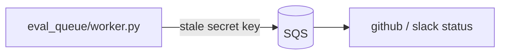

# Visual artifacts — diagrams, screenshots, recordings

Attach anything that clarifies behavior or eases validation. **Upload via `gh-attach`** so the file lands at `user-attachments.githubusercontent.com`; never commit images/videos to the repo, never use `raw.githubusercontent.com`, never embed secrets, tokens, or machine-specific paths. If the local machine lacks a browser-authed GitHub session, run `gh-attach` from a trusted machine (SSH is fine) or pass `--session-file`, keeping the wording generic in public PRs.

## Screenshots & recordings

A before/after **recording** earns its place with a caption: capture conditions (tool, dimensions, playback speed), what to watch, and a quantified delta (e.g., terminal-write bytes/events, request count, p95 latency). A bare clip with no caption is net-zero — the reviewer can't tell what changed or by how much.

## Diagrams

Draw when the PR adds/alters components, flows, service boundaries, integration points, or module structure. Signal: you're describing a new flow across more than two sentences of the Description. **Excalidraw is the primary path**; Mermaid (below) is the fallback only when you truly can't install the toolchain on this host, or for a throwaway flow.

### Primary: excalidraw

**Invoke the `excalidraw` skill for authoring, render, and embed** — it owns the visual register, colors, dark-mode, `excalirender --dark -s 2`, and the `gh-attach` + editable-link `<details>` workflow; don't re-derive any of it here. For a PR it's the **technical** register (reviewer-grade), embedded under `## Architecture`.

**A diagram must carry what prose can't.** Box-and-arrow renderings of the section headings are net-zero and reviewers call them out. Earn the space with real symbol/file names in the boxes, the data labeled on each arrow, and — for behavior changes — a before/after timeline (old failure mode vs new invariant, with example rows).

**Two diagrams often beat one for a complex behavior change**: a component/data-flow pipeline *and* a before/after timeline of the observable effect, each with its own editable-link `<details>`.

### Fallback: Mermaid

A tool you *could* install is never a reason to land here — Mermaid is for hosts where you genuinely can't (locked-down/headless), or a throwaway flow. It renders natively in the GitHub body (no upload, editable in-PR, diffable) but trades away layout control, pastel/dark theming, and clean wrapping of wide labels; prefer excalidraw for anything multi-subsystem or with a before/after timeline.

The same quality bar applies: real symbol/file names in the nodes, data labeled on each edge — never box-and-arrow restatements of the section headings. Embed the fenced block directly under `## Architecture` (no upload, no `<details>`):

````markdown
## Architecture


````
