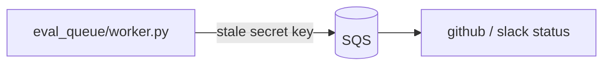

# Visual artifacts — diagrams, screenshots, recordings

Attach anything that clarifies behavior or eases validation. **Upload via `gh-attach`** so the file lands at `user-attachments.githubusercontent.com`; never commit images/videos to the repo, never use `raw.githubusercontent.com`, never embed secrets, tokens, or machine-specific paths. If the local machine lacks a browser-authed GitHub session, run `gh-attach` from a trusted machine (SSH is fine) or pass `--session-file`, keeping the wording generic in public PRs.

## Screenshots & recordings

A before/after **recording** earns its place with a caption: capture conditions (tool, dimensions, playback speed), what to watch, and a quantified delta (e.g., terminal-write bytes/events, request count, p95 latency). A bare clip with no caption is net-zero — the reviewer can't tell what changed or by how much.

## Diagrams

Draw when the PR adds/alters components, flows, service boundaries, integration points, or module structure. Signal: you're describing a new flow across more than two sentences of the Description. **Excalidraw (dark-mode PNGs via excalirender) is the primary path**; Mermaid is a fallback (below) for when the excalirender/`gh-attach` toolchain isn't available or a quick flow is all the change warrants.

### Primary: excalidraw (dark-mode PNGs via excalirender)

**A diagram must carry what prose can't.** Box-and-arrow renderings of the section headings are net-zero and reviewers call them out. Earn the space with: real symbol/file names in the boxes, the data labeled on each arrow, and — for behavior changes — a concrete before/after timeline (old failure mode vs new invariant, with example rows). After rendering, `Read` the PNG: excalirender glyphs run wider than naive estimates, so size boxes and label gaps generously and re-render until nothing overflows or collides.

**Two diagrams often beat one for a complex behavior change**: a component/data-flow pipeline *and* a before/after timeline of the observable effect (what the user or system sees across renders/requests). Embed both under `## Architecture`, each with its own editable-link `<details>`.

**Render** with `--dark -s 2` (skip `--dark` only if the user asks for light).

**Authoring** (full failure modes: `~/.agents/skills/excalidraw/references/dark-mode.md`):

- Author in **light** theme — pastel fills (`~/.agents/skills/excalidraw/references/colors.md`), `#1e1e1e` text, white or omitted `viewBackgroundColor`. `--dark` is an inverter; pre-coloring dark double-inverts into mush.
- **No manual background rectangle** — it inflates the scene bbox and the diagram renders as a speck.
- Pastel families map to dark at render time: Frontend/Input Blue · Backend/Success Green · Storage/Data Teal · Processing Purple · External/Warning Orange · Error Red · Notes Yellow.

**Workflow**:

```bash
excalirender diagram.excalidraw -o /tmp/diagram.png --dark -s 2
gh-attach --repo "$REPO" --md /tmp/diagram.png        # copy the returned markdown
uv run --with cryptography python ~/.agents/skills/excalidraw/scripts/upload.py diagram.excalidraw  # optional editable link
```

Embed under `## Architecture`; nest the editable link in `<details>` so it doesn't read as a phishing link:

```markdown
## Architecture


<details><summary>Edit diagram</summary>

Source: https://excalidraw.com/#json=...
Rendered with: `excalirender diagram.excalidraw -o /tmp/diagram.png --dark -s 2`
</details>
```

### Fallback: Mermaid

Reach for Mermaid only when the excalidraw path is blocked — no `excalirender`, no browser-authed `gh-attach` — or when a quick flow/sequence is all the change warrants. It renders natively in the GitHub body (no upload, editable in-PR, diffable), but you trade away layout control and the pastel/dark theming, and wide labels wrap awkwardly. Prefer excalidraw for anything multi-subsystem or carrying a before/after timeline.

The same quality bar applies: real symbol/file names in the nodes, data labeled on each edge — never box-and-arrow restatements of the section headings. Embed the fenced block directly under `## Architecture` (no upload, no `<details>`):

````markdown
## Architecture


````
