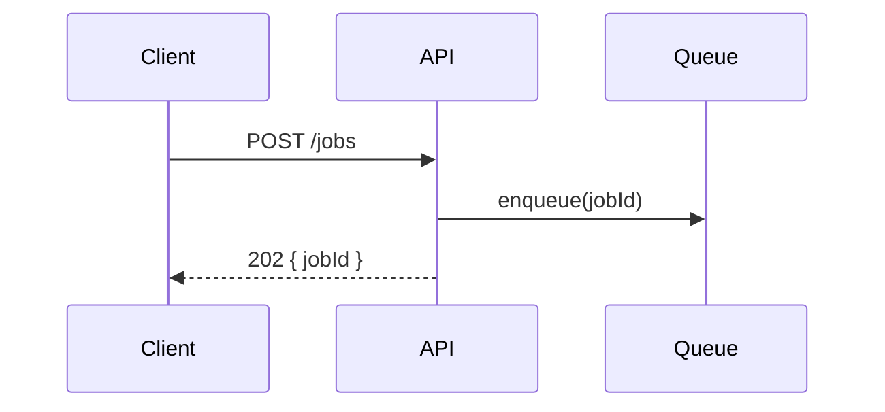
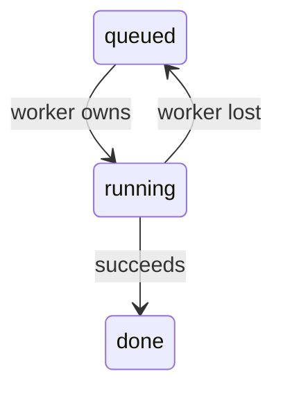
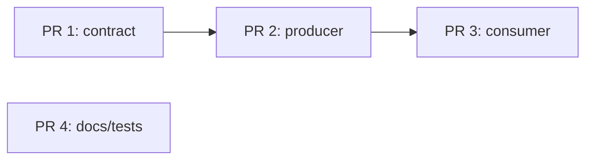

# Representation selection

Start from the reader's question, not from the form. Take the smallest view
that makes the answer obvious, then render it in the grammar the destination
displays (`surfaces.md`). A table is a view when alignment carries meaning; an
elaborate diagram is not inherently better than four typed lines.

## Question to view

Scope the view to a concrete relationship or decision. A broad PR outcome may
depend on several independent mechanisms; draw the one a reviewer must hold
first, rather than turn the whole change inventory into one ordered flow.
When no relation earns the section, let the owning workflow omit it.

| Reader's question | Primary view | Must contain |
|---|---|---|
| Where does each responsibility live? | Responsibility tree | real paths, one responsibility each |
| How is the UI composed, where does state live? | Component tree (JSX) | real components, state owners, boundaries |
| What calls what? | Call tree | real symbols; changed or failing edges marked |
| Who acts in what order? | Sequence | actors, ordered messages, payload or state on arrows |
| How can state change? | State table or state diagram | prior state, event, next state, invariant |
| What does the algorithm do? | Typed code or labelled pseudocode | decisions, mutations, return shape |
| What shape should the code have? | Types and signatures | minimal types, function boundaries, ownership |
| What structurally changed? | Before/after of real structure | unchanged context plus the delta |
| Which work depends on which? | Dependency graph | nodes, directed edges, independent branches |
| Which path produced the failure? | Causal flow | expected path, first wrong edge, downstream symptom |
| How much changed, under what conditions? | Quantitative comparison | units, scale, baseline, measurement frame, delta |

## Code companion

The primary view may carry one typed block beside it when a reader needs a
detail the view cannot hold: the signature behind a changed call-tree edge, the
discriminated union behind a state table, the branch that selects a sequence
path. The companion fills a gap; it never restates the view or the prose. When
the primary view is already code (algorithm, types), there is no companion.

## Layout must encode a relation

Indentation, arrows, rows, and diff lines each mean one thing a reader can
follow: call nesting, containment, ownership, sequence, decision, transition,
or dependency. Verbs are fine as labels: `worker owns` on a transition,
`request boundary` beside a file, `stale secret key` on a data edge. The defect
is layout that means nothing: branches that enumerate what a node also does,
siblings whose adjacency carries no order or ownership, a `diff` whose lines
are summary sentences. Such a view passes every length check and shows nothing.

Enumeration dressed as a tree (reject):

```diff
 request
-└── route owns retry + persistence + response
+└── runner
+    ├── owns retry + persistence
+    └── returns final result to route
```

The two branches under `runner` are sentences about it; indentation means only
"same paragraph", and the reader still cannot tell what calls what or where
the retry loop lives.

The relation it summarized (accept; illustrative symbols):

```text
handleRequest()                         route.ts
└── runJob(job, signal)                 runner.ts   ← new owner
    ├── withRetry(attempt)
    └── persistResult(jobId, result)    store.ts
```

```ts
// runner.ts (illustrative)
export function runJob(job: QueuedJob, signal: AbortSignal): Promise<DoneJob>
```

Indentation now means "called by", and every line is a symbol the reader can
open. If the diff has no relation to draw (several unrelated concerns), say so
and let the owning workflow omit its section.

## Code fidelity

- Verbatim source carries its path (and line range when the reader should open
  it). Never edit quoted lines silently; mark elisions with `// ...`.
- Whole block or small diff: show the whole function when its control flow is
  the point or most lines changed; show a `diff` hunk when unchanged context
  dominates and the delta is a few lines. Either way the fence is real source.
- Pseudocode and proposed shapes are labelled (`// pseudocode`,
  `// illustrative`) and use a typed fence so highlighting preserves shape.
- Prefer one canonical type per meaning; show only fields consumers observe.

## Inline grammars

Every example below is illustrative; its symbols are placeholders for real
ones. Text grammars render everywhere. Mermaid variants render on GitHub and
in a browser (`surfaces.md`).

### Responsibility tree

```text
feature/
├── route.ts       request boundary
├── service.ts     canonical orchestration
└── repository.ts  persistence only
```

Keep it shallow; include only paths needed to explain ownership.

### Component tree

Use JSX: it is the composition language the reader already knows, and props
and state annotations sit where they apply.

```tsx
<CheckoutPage>
  <CartSummary items={cart.items} />
  <PaymentForm />                     {/* owns: payment draft */}
  <SubmitBoundary>                    {/* reads: cart + payment */}
    <ErrorNotice />                   {/* state: submit result */}
  </SubmitBoundary>
</CheckoutPage>
```

Include only state and boundaries that affect the question; never the full
component catalog.

### Call tree

```text
handleRequest()
└── resolveTarget()
    ├── loadItems()
    └── selectCandidate()  ← changed
```

Indentation means synchronous ownership. Label async, conditional, retry, or
fan-out edges explicitly; when the condition itself matters, quote it as a
code companion.

### Sequence

Terminal grammar:

```text
1. User   → Client: click submit
2. Client → API:    POST /jobs
3. API    → Queue:  enqueue(jobId)
4. API    → Client: 202 { jobId }
5. Queue  → Worker: deliver(jobId)
```

GitHub and browser grammar:



Use a sequence only when order across actors matters. Put payloads or state
changes on arrows; omit actors that do no work. Never draw fixed-width text
lifelines: label width and wrapping make arrows land on the wrong actor.

Every lifeline is an actor the source shows sending or receiving each message
drawn on it: a process, function, service, or queue with a name a reader can
open. An enclosing boundary is not an actor; it groups the actors it
encloses (Mermaid `box`, or a labelled divider in the numbered grammar), and a
step that runs inside one belongs to the actor that executes it. When the
source does not establish the order between two steps, omit one or mark the
edge `order unverified` rather than pick one; independent concerns are not a
lifecycle.

### State table and state diagram

```text
| Before  | Event       | After   | Invariant                  |
|---------|-------------|---------|----------------------------|
| queued  | worker owns | running | one owner                  |
| running | succeeds    | done    | result persisted before UI |
```



The table carries invariants; the diagram carries topology. Do not collapse
distinct states to shorten either.

### Typed code and pseudocode

```ts
// pseudocode
for (const item of items) {
  if (!eligible(item)) continue
  candidates.push(score(item))
}
return maxBy(candidates, candidate => candidate.score)
```

Show decisions, mutations, and output. Omit language ceremony unless it
changes behavior.

### Types and signatures

```ts
type JobState =
  | { status: "queued" }
  | { status: "running"; owner: WorkerId }
  | { status: "done"; result: Result }

run(job: QueuedJob): Promise<DoneJob>
```

### Before/after of real structure

Use a `diff` fence over a tree, a type, or a source hunk when most structure is
unchanged and the delta is small:

```diff
 type JobState =
   | { status: "queued" }
-  | { status: "running" }
+  | { status: "running"; owner: WorkerId }
   | { status: "done"; result: Result }
```

Every changed line is structure a reader can find; see "Layout must encode a
relation".

For a graphical contrast, use before/after panels separated by a labelled
divider. Keep unchanged actors in corresponding positions, mute unchanged
structure, and highlight the changed edge or boundary. The panels must expose
the delta, not repeat two inventories. Use the caller's existing contrast
classes rather than inventing another theme.

### Dependency graph

```text
PR 1: contract ──> PR 2: producer ──> PR 3: consumer

PR 4: docs/tests   (independent)
```



State atomic groups explicitly. Never draw an edge merely because one item is
planned earlier.

### Causal flow

```text
Expected: command → canonical runner → child group → complete evidence
                                  ×
Observed: command → detached shell → truncated log → false failure
                         ↑ first wrong edge
```

Mark the first unintended transition, not only the visible error. A code
companion may quote the line where the wrong edge originates.

### Quantitative comparison

Use a table for exact values, or aligned bars when relative magnitude is the
question. Label units, measurement conditions, and the delta beside the value.
Bars encoding magnitude start at zero; a narrowed axis is valid for a bounded
metric (such as ROC-AUC from 0.5 to 1.0) only when its baseline is explicit in
both axis and caption. Comparisons share a scale. Different benchmark frames
need separate groups and a clear non-comparability note, not proximity that
implies a head-to-head result. Use real grid lines, not gradients.

## Fidelity check

Before emitting:

1. Every node, edge, type, and quoted line traces to verified evidence.
2. Direction means exactly one thing throughout.
3. Unknowns are visibly unknown; absence is not presented as proof.
4. The view preserves every state or dependency the claim needs.
5. Removing any remaining node would make the answer incomplete; otherwise
   remove it.
6. Every indentation, arrow, and row encodes a relation a reader can follow.
7. The implication adds a consequence, not a transcription of the view.
